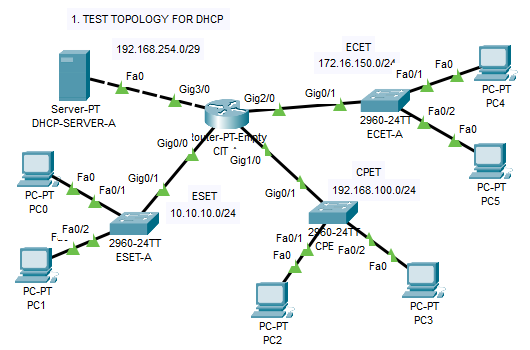
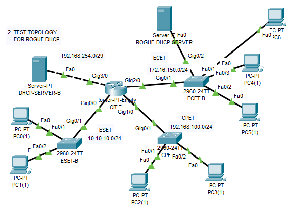

# DHCP Snooping

## Discussion

### Introduction

DHCP Snooping is a Layer 2 security feature implemented on network switches to enhance the security of Dynamic Host Configuration Protocol (DHCP) operations. It mitigates risks posed by unauthorized DHCP servers, which can lead to network vulnerabilities such as man-in-the-middle attacks or denial-of-service incidents. By filtering DHCP messages, DHCP Snooping ensures that only legitimate DHCP servers assign IP addresses to clients.

### How DHCP Snooping Works

- **Trusted vs. Untrusted Ports**:
    - **Trusted Ports**: Connected to legitimate DHCP servers or upstream devices leading to them. These ports are allowed to send DHCP server responses (e.g., DHCPOFFER, DHCPACK).
    - **Untrusted Ports**: Connected to clients or potential rogue servers. DHCP server messages from these ports are dropped.
- **Filtering Process**:
    - DHCP Snooping intercepts DHCP messages.
    - It builds a binding table mapping client MAC addresses, IP addresses, lease times, and switch ports.
    - Only DHCP responses from trusted ports are forwarded to clients.
- **Benefits**:
    - Prevents unauthorized DHCP servers from assigning IPs.
    - Protects against IP spoofing and network disruption.
    - Enhances network reliability by ensuring correct IP assignments.

### Common Threats Mitigated

- **Man-in-the-Middle Attacks**: A rogue DHCP server could assign itself as the default gateway, intercepting traffic.
- **Denial of Service (DoS)**: Invalid IP assignments can disrupt client connectivity.
- **IP Address Exhaustion**: Rogue servers might exhaust the IP pool, preventing legitimate assignments.

---

## Practical Example

### Scenario 1: Test Topology for DHCP

#### Objective

Establish a baseline DHCP setup with a legitimate DHCP server to ensure proper IP assignment across multiple departments.

#### Devices and Connections

**Router (CIT-A)**:

- gig0/0: Connected to ESET-A gig0/1 (10.10.10.1/24)
    
- gig1/0: Connected to CPET-A gig0/1 (192.168.100.1/24)
    
- gig2/0: Connected to ECET-A gig0/1 (172.16.150.1/24)
    
- gig3/0: Connected to DHCP-SERVER-A fa0 (192.168.254.1/29)
    
- **Switches**:
    
- **ESET-A (10.10.10.0/24)**:
    
    - gig0/1: To CIT-A gig0/0
    - fa0/1: To PC1 fa0
    - fa0/2: To PC2 fa0
    - **CPET-A (192.168.100.0/24)**:
        - gig0/1: To CIT-A gig1/0
        - fa0/1: To PC2 fa0
        - fa0/2: To PC3 fa0
    - **ECET-A (172.16.150.0/24)**:
        - gig0/1: To CIT-A gig2/0
        - fa0/1: To PC4 fa0
        - fa0/2: To PC5 fa0
- **DHCP-SERVER-A (192.168.254.0/29)**:
    
    - fa0: To CIT-A gig3/0
    - IP: 192.168.254.2 (assigned manually)
- **PCs**: PC0 to PC5 across the three switches.
    

#### Configuration Steps

##### Step 1: Assign and Map IP Addresses

Assign IP addresses to the router interfaces and DHCP server:

- **Router (CIT-A)**:

```
enable
configure terminal
interface GigabitEthernet0/0
 ip address 10.10.10.1 255.255.255.0
interface GigabitEthernet1/0
 ip address 192.168.100.1 255.255.255.0
interface GigabitEthernet2/0
 ip address 172.16.150.1 255.255.255.0
interface GigabitEthernet3/0
 ip address 192.168.254.1 255.255.255.248
exit
exit
write
```

- **DHCP-SERVER-A**:
    - IP: 192.168.254.2/29 (manually assigned via GUI or CLI)

##### Step 2: Configure the Legitimate DHCP Server

On **DHCP-SERVER-A**, configure DHCP pools:

- Navigate to "Services > DHCP" in the server GUI.
- Configure the following pools:
    - **Pool for ESET-A (10.10.10.0/24)**:
        - Pool Name: ESET-A
        - Default Gateway: 10.10.10.1
        - Start IP Address: 10.10.10.2 (excluding gateway)
        - Subnet Mask: 255.255.255.0
        - Maximum Number of Users: 254
    - **Pool for CPET-A (192.168.100.0/24)**:
        - Pool Name: CPET-A
        - Default Gateway: 192.168.100.1
        - Start IP Address: 192.168.100.2 (excluding gateway)
        - Subnet Mask: 255.255.255.0
        - Maximum Number of Users: 254
    - **Pool for ECET-A (172.16.150.0/24)**:
        - Pool Name: ECET-A
        - Default Gateway: 172.16.150.1
        - Start IP Address: 172.16.150.2 (excluding gateway)
        - Subnet Mask: 255.255.255.0
        - Maximum Number of Users: 254
- Save all configurations.
- Ensure the "Service" radio button is set to ON.

##### Step 3: Configure the Router

On **CIT-A**, enable interfaces and configure IP helper addresses:

- **Enable All Interfaces**:

```
enable
configure terminal
interface range gigabitEthernet0/0-3
 no shutdown
exit
exit
write
```

- **Configure Interface gig0/0 (ESET Department)**:

```
enable
configure terminal
interface gigabitEthernet0/0
 ip address 10.10.10.1 255.255.255.0
 ip helper-address 192.168.254.2
exit
exit
write
```

- **Configure Interface gig1/0 (CPET Department)**:

```
enable
configure terminal
interface gigabitEthernet1/0
 ip address 192.168.100.1 255.255.255.0
 ip helper-address 192.168.254.2
exit
exit
write
```

- **Configure Interface gig2/0 (ECET Department)**:

```
enable
configure terminal
interface gigabitEthernet2/0
 ip address 172.16.150.1 255.255.255.0
 ip helper-address 192.168.254.2
exit
exit
write
```

##### Step 4: Assign End Devices with DHCP

- On each PC (PC0 to PC5):
    - Navigate to "Desktop > IP Configuration".
    - Switch from "Static" to "DHCP".
    - Wait for the DHCP assignment.
    - Look for a message: "DHCP request successful".
    - If unsuccessful, debug by checking server settings, router helper addresses, and connectivity.

#### Results and Observations

- PCs successfully obtain IPs from DHCP-SERVER-A:
    - ESET-A: e.g., 10.10.10.2
    - CPET-A: e.g., 192.168.100.2
    - ECET-A: e.g., 172.16.150.2
- Verify connectivity by pinging the respective gateways (e.g., 10.10.10.1 for ESET-A PCs).

---

### Scenario 2: Test Topology for Rogue DHCP

#### Objective

Test DHCP Snooping to ensure that, despite the presence of a rogue DHCP server, only the legitimate DHCP server assigns IPs to clients, protecting the network from unauthorized servers.

#### Devices and Connections

- **Router (CIT-B)**:
    - gig0/0: Connected to ESET-B gig0/1 (10.10.10.1/24)
    - gig1/0: Connected to CPET-B gig0/1 (192.168.100.1/24)
    - gig2/0: Connected to ECET-B gig0/1 (172.16.150.1/24)
    - gig3/0: Connected to DHCP-SERVER-B fa0 (192.168.254.1/29)
- **Switches**:
    - **ESET-B (10.10.10.0/24)**:
        - gig0/1: To CIT-B gig0/0
        - fa0/1: To PC1(1) fa0
        - fa0/2: To PC2(1) fa0
    - **CPET-B (192.168.100.0/24)**:
        - gig0/1: To CIT-B gig1/0
        - fa0/1: To PC2(1) fa0
        - fa0/2: To PC3(1) fa0
    - **ECET-B (172.16.150.0/24)**:
        - gig0/1: To CIT-B gig2/0
        - gig0/2: To ROGUE-DHCP-SERVER fa0
        - fa0/1: To PC4(1) fa0
        - fa0/2: To PC5(1) fa0
- **DHCP-SERVER-B (192.168.254.0/29)**:
    - fa0: To CIT-B gig3/0
    - IP: 192.168.254.2 (assigned manually)
- **ROGUE-DHCP-SERVER**:
    - fa0: To ECET-B gig0/2
    - IP: 172.16.150.254/24 (assigned manually)
- **PCs**: PC0(1) to PC5(1) across the three switches.

#### Configuration Steps

##### Step 1: Assign and Map IP Addresses

Assign IP addresses to the router interfaces and DHCP servers:

- **Router (CIT-B)**:

```
enable
configure terminal
interface GigabitEthernet0/0
 ip address 10.10.10.1 255.255.255.0
interface GigabitEthernet1/0
 ip address 192.168.100.1 255.255.255.0
interface GigabitEthernet2/0
 ip address 172.16.150.1 255.255.255.0
interface GigabitEthernet3/0
 ip address 192.168.254.1 255.255.255.248
exit
exit
write
```

- **DHCP-SERVER-B**:
    - IP: 192.168.254.2/29 (manually assigned via GUI or CLI)
- **ROGUE-DHCP-SERVER**:
    - IP: 172.16.150.254/24 (manually assigned via GUI or CLI)

##### Step 2: Configure the Legitimate DHCP Server

On **DHCP-SERVER-B**, configure DHCP pools:

- Navigate to "Services > DHCP" in the server GUI.
- Configure the following pools:
    - **Pool for ESET-B (10.10.10.0/24)**:
        - Pool Name: ESET-A
        - Default Gateway: 10.10.10.1
        - Start IP Address: 10.10.10.2 (excluding gateway)
        - Subnet Mask: 255.255.255.0
        - Maximum Number of Users: 2
    - **Pool for CPET-B (192.168.100.0/24)**:
        - Pool Name: CPET-A
        - Default Gateway: 192.168.100.1
        - Start IP Address: 192.168.100.2 (excluding gateway)
        - Subnet Mask: 255.255.255.0
        - Maximum Number of Users: 2
    - **Pool for ECET-B (172.16.150.0/24)**:
        - Pool Name: ECET-A
        - Default Gateway: 172.16.150.1
        - Start IP Address: 172.16.150.2 (excluding gateway)
        - Subnet Mask: 255.255.255.0
        - Maximum Number of Users: 2
- Save all configurations.
- Ensure the "Service" radio button is set to ON.

##### Step 3: Configure the Router

On **CIT-B**, enable interfaces and configure IP helper addresses:

- **Enable All Interfaces**:

```
enable
configure terminal
interface range gigabitEthernet0/0-3
 no shutdown
exit
exit
write
```

- **Configure Interface gig0/0 (ESET Department)**:

```
enable
configure terminal
interface gigabitEthernet0/0
 ip address 10.10.10.1 255.255.255.0
 ip helper-address 192.168.254.2
exit
exit
write
```

- **Configure Interface gig1/0 (CPET Department)**:

```
enable
configure terminal
interface gigabitEthernet1/0
 ip address 192.168.100.1 255.255.255.0
 ip helper-address 192.168.254.2
exit
exit
write
```

- **Configure Interface gig2/0 (ECET Department)**:

```
enable
configure terminal
interface gigabitEthernet2/0
 ip address 172.16.150.1 255.255.255.0
 ip helper-address 192.168.254.2
exit
exit
write
```

##### Step 4: Configure Rogue DHCP Server

- On **ROGUE-DHCP-SERVER**:
    - Navigate to "Services > DHCP".
    - Create a pool:
        - Pool Name: Rogue-Pool
        - Network: 172.16.150.0/24
        - Default Gateway: 172.16.150.254
        - Start IP Address: 172.16.150.200
        - Subnet Mask: 255.255.255.0
        - Maximum Number of Users: 254
    - Save and ensure the "Service" radio button is ON.

##### Step 5: Connect Rogue DHCP Server to Network Switch

- Ensure the ROGUE-DHCP-SERVER is connected to ECET-B via gig0/2 as specified in the topology.

##### Step 6: Limit the Number of PCs on the Legitimate DHCP Server

- This step is already reflected in Step 2, where the Maximum Number of Users for each pool on DHCP-SERVER-B is set to 2.

##### Step 7: Add PCs and Switch to DHCP

- On PC4(1) and PC5(1) (connected to ECET-B):
    - Navigate to "Desktop > IP Configuration".
    - Switch from "Static" to "DHCP".
- Add an additional PC (e.g., PC6(1)) to ECET-B (e.g., on fa0/3):
    - Navigate to "Desktop > IP Configuration".
    - Switch from "Static" to "DHCP".
- **Observation**: Since DHCP-SERVER-B is limited to 2 users per pool, only two PCs (e.g., PC4(1) and PC5(1)) will get IPs from the legitimate server (e.g., 172.16.150.2 and 172.16.150.3). The third PC (PC6(1)) will receive an IP from the ROGUE-DHCP-SERVER (e.g., 172.16.150.200).

##### Step 8: Configure Security by Enabling DHCP Snooping

On **ECET-B** (since the rogue server is connected here):

```
enable
configure terminal
ip dhcp snooping
ip dhcp snooping vlan 1  # Assuming VLAN 1
interface GigabitEthernet0/1  # Port to CIT-B (path to legitimate DHCP server)
 ip dhcp snooping trust
exit
exit
write
```

- Note: gig0/2 (to ROGUE-DHCP-SERVER) remains untrusted.

##### Step 9: Add More PCs and Test with DHCP Snooping

- Add another PC (e.g., PC7(1)) to ECET-B (e.g., on fa0/4):
    - Navigate to "Desktop > IP Configuration".
    - Switch to DHCP.
- **Observation**: With DHCP Snooping enabled, PC7(1) should attempt to get an IP from the legitimate server. Since the legitimate server's pool is already exhausted (limited to 2 users), the PC will not get an IP because rogue responses are now blocked.

#### Results and Observations

- **Before DHCP Snooping**:
    - PC4(1) and PC5(1) get IPs from DHCP-SERVER-B (e.g., 172.16.150.2 and 172.16.150.3).
    - PC6(1) gets an IP from ROGUE-DHCP-SERVER (e.g., 172.16.150.200), indicating a security risk.
- **After DHCP Snooping**:
    - Rogue DHCP responses are blocked.
    - Additional PCs (e.g., PC7(1)) cannot get IPs from the rogue server.
    - Since the legitimate server is limited to 2 users, no further IPs are assigned.
- **Verification**:
    - Use `show ip dhcp binding` on the DHCP server to confirm assignments.
    - Use `show ip dhcp snooping binding` on ECET-B to verify the binding table.
    - Check PC IP configurations and connectivity (e.g., ping the gateway).

---

### Key Takeaways

- DHCP Snooping prevents unauthorized DHCP servers from assigning IPs, even when the legitimate server’s pool is exhausted.
- Limiting the number of users on the legitimate DHCP server highlights the need for DHCP Snooping to block rogue servers.
- Trusted port configuration is critical for secure DHCP operation.
- Proper IP helper configuration ensures DHCP requests reach the legitimate server.
- Testing with a rogue server validates DHCP Snooping’s effectiveness.