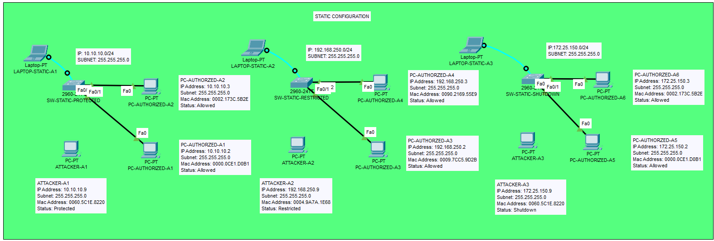
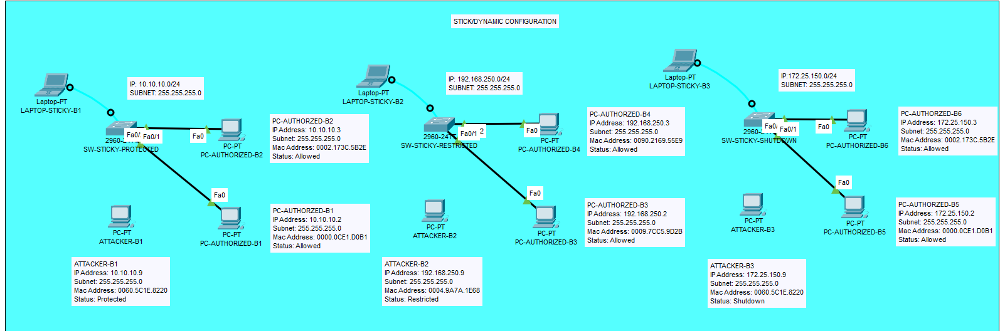

# Switch Port Security

## Overview

Switchport Security is a critical Layer 2 security feature on Cisco switches designed to prevent unauthorized access to a network by controlling which devices can connect to specific switch ports. It restricts access based on the MAC addresses of devices, ensuring only authorized devices can communicate through a designated port. This feature is particularly valuable in environments where physical access to switch ports is possible—such as shared office spaces, public areas, or educational institutions—helping to mitigate risks from rogue devices attempting to gain network access.

Switchport Security is commonly used to enhance network security by limiting the number of devices per port, learning authorized MAC addresses dynamically, and taking predefined actions when violations occur. It’s an essential tool for network administrators aiming to secure access layers in a LAN environment.

## Key Features

### MAC Address-Based Control

Switchport Security functions by associating a switch port with one or more MAC addresses, allowing only specified devices to connect. By default, when configured with the `sticky` option, the switch permits only the first MAC address it learns (i.e., the first device that connects) to communicate through the port. If a device with a different MAC address attempts to connect, the switch detects this as a violation and responds based on the configured violation mode. Administrators can also manually specify MAC addresses for tighter control.

- **Maximum MAC Addresses**: You can configure the maximum number of MAC addresses allowed on a port (default is 1). This is useful for scenarios where multiple devices (e.g., a phone and a PC via a switch) need to share a single port.
- **Violation Detection**: The switch monitors traffic to ensure only authorized MAC addresses are used, flagging any mismatches as violations.

### Non-Trunking Port Requirement

Switchport Security can only be applied to access ports, not trunk ports. Access ports are typically connected to end devices (e.g., PCs, laptops, or IP phones) and carry traffic for a single VLAN. Trunk ports, on the other hand, are used to carry traffic for multiple VLANs between switches or to routers, making them unsuitable for Switchport Security. Attempting to enable Switchport Security on a trunk port will result in an error on Cisco switches, as the feature is designed to secure individual device connections, not inter-switch links.

- **Command Requirement**: Before enabling Switchport Security, the port must be set to access mode using `switchport mode access`.

### Sticky MAC Address Learning

The "sticky" learning option provides a balance between automation and security. When enabled, the switch dynamically learns the MAC address of the first device that connects to the port and stores it in the running configuration as a secure MAC address. From that point, only that MAC address is allowed to communicate through the port until the configuration is manually changed or cleared. This feature reduces administrative overhead compared to manually configuring static MAC addresses while still maintaining tight control over port access.

- **Persistence**: If the switch is reloaded without saving the configuration, the sticky MAC addresses are lost unless the running configuration is saved to the startup configuration with `copy running-config startup-config`.
- **Flexibility**: Sticky learning is ideal for semi-permanent setups where devices may occasionally change but unauthorized access must be prevented.

## Configuration Options

Switchport Security offers two primary methods for defining allowed MAC addresses, each with its own use case depending on the network’s requirements.

### Static MAC Address

In this method, the administrator manually specifies the MAC address(es) allowed on a port using the `switchport port-security mac-address [MAC_ADDRESS]` command. This approach provides the highest level of control since only the explicitly defined MAC addresses can connect.

- **Use Case**: Best for environments where devices are fixed and rarely change, such as servers or critical infrastructure.
- **Drawback**: Labor-intensive and doesn’t scale well in large or dynamic networks due to the need for manual updates when devices change.
- **Example Command**: `switchport port-security mac-address 0000.0CE1.D0B1`

### Sticky/Dynamic MAC Address

The sticky option automates MAC address learning while maintaining security. When enabled with `switchport port-security mac-address sticky`, the switch learns the first MAC address that connects to the port and automatically adds it to the running configuration as a secure MAC address. Subsequent connections are restricted to that MAC address.

- **Use Case**: Ideal for environments where devices are semi-permanent but may change occasionally, such as employee workstations in an office.
- **Advantage**: Reduces manual configuration effort compared to static MAC addresses while still ensuring security.
- **Example Behavior**: If a laptop with MAC address 0060.5C1E.8220 connects first, the switch will lock the port to that address, and any other device will trigger a violation.

### Enabling Switchport Security

To enable Switchport Security, the following steps are typically required on a Cisco switch:

1. Set the port to access mode: `switchport mode access`
2. Enable port security: `switchport port-security`
3. (Optional) Set the maximum number of MAC addresses: `switchport port-security maximum [NUMBER]`
4. Specify the MAC address method (static or sticky):
    - Static: `switchport port-security mac-address [MAC_ADDRESS]`
    - Sticky: `switchport port-security mac-address sticky`
5. Configure the violation mode: `switchport port-security violation {protect | restrict | shutdown}`

## Handling Violations

When an unauthorized device (i.e., a device with a MAC address not matching the secure MAC address) attempts to connect, the switch responds based on the configured violation mode. There are three possible actions:

### Protect Mode

In Protect mode, the switch silently drops packets from the unauthorized device without logging or notifying the administrator. The port remains active, allowing authorized devices to continue communicating.

- **Use Case**: Useful when you want to block unauthorized access without disrupting legitimate users or generating excessive logs.
- **Drawback**: Lack of logging makes it harder to detect and investigate security incidents.
- **Command**: `switchport port-security violation protect`

### Restrict Mode

In Restrict mode, the switch drops packets from the unauthorized device and logs the violation, typically sending a syslog message or SNMP trap. This provides visibility into potential security issues without disabling the port.

- **Use Case**: Helpful for monitoring and auditing purposes, allowing administrators to track unauthorized access attempts.
- **Behavior**: The violation counter increments, and the event is logged for review.
- **Command**: `switchport port-security violation restrict`

### Shutdown Mode

In Shutdown mode, the switch takes the most severe action by shutting down the port entirely when a violation occurs. The port enters an "err-disabled" state, and no traffic (authorized or unauthorized) can pass until the port is manually re-enabled by the administrator.

- **Use Case**: Ensures maximum security by completely blocking access until the issue is investigated and resolved.
- **Default Mode**: This is the default violation mode when Switchport Security is enabled.
- **Recovery**: To re-enable the port, use `shutdown` followed by `no shutdown` on the interface, or configure automatic recovery with `errdisable recovery cause psecure-violation`.
- **Command**: `switchport port-security violation shutdown`

### Monitoring Violations

To monitor the status of Switchport Security and detect violations, use the following commands:

- `show port-security`: Displays the port security configuration and status for all ports, including secure MAC addresses and violation counts.
- `show port-security interface [INTERFACE]`: Provides detailed information about a specific port, such as the secure MAC address, maximum allowed MAC addresses, and current violation count.
- `show running-config`: Verifies the sticky MAC addresses saved in the configuration.

## Practical Examples

This section provides hands-on examples of Switchport Security configurations using both static and dynamic (sticky) MAC address methods, demonstrating the three violation modes: Protected, Restricted, and Shutdown. These examples are designed to help you understand how to implement and test Switchport Security in a lab environment, such as in Cisco Packet Tracer, for your CPET18L - Network Security studies.

### Static Configuration

Static Configuration involves manually specifying the allowed MAC addresses on a switch port. The following examples use a network with the IP range 10.10.10.0/24 (Subnet Mask: 255.255.255.0) for Protected mode, and 192.168.0.0/24 and 172.25.150.0/24 for Restricted and Shutdown modes, respectively, as derived from the topology.

#### Protected Mode

**Network Details**

- **IP Range**: 10.10.10.0/24
- **Subnet Mask**: 255.255.255.0

**Devices**

- **Laptop**: LAPTOP-STATIC-A1 (connected via RS232 to the console port of the switch for configuration, no IP address)
- **Switch**: SW-STATIC-PROTECTED (Cisco 2960)
- **PCs**:
    - PC-AUTHORIZED-A1: IP 10.10.10.2, Subnet 255.255.255.0, MAC 0000.0CE1.D0B1, Status: Allowed
    - PC-AUTHORIZED-A2: IP 10.10.10.3, Subnet 255.255.255.0, MAC 0002.173C.5B2E, Status: Allowed
    - ATTACKER-A1: IP 10.10.10.9, Subnet 255.255.255.0, MAC 0060.5C1E.8220, Status: Protected

**Topology**

- SW-STATIC-PROTECTED:
    - FastEthernet0/1 → PC-AUTHORIZED-A1 (Fa0)
    - FastEthernet0/2 → PC-AUTHORIZED-A2 (Fa0)
- ATTACKER-A1: Waiting to connect to any port for testing violations

**Configuration on SW-STATIC-PROTECTED**  
The goal is to configure Switchport Security on FastEthernet0/1 and FastEthernet0/2 to allow only the specified MAC addresses and set the violation mode to Protect. In Protect mode, packets from unauthorized devices (e.g., ATTACKER-A1) will be silently dropped without logging.

```
enable
configure terminal

interface FastEthernet0/1
 switchport mode access
 switchport port-security
 switchport port-security maximum 1
 switchport port-security mac-address 0000.0CE1.D0B1
 switchport port-security violation protect
 exit

interface FastEthernet0/2
 switchport mode access
 switchport port-security
 switchport port-security maximum 1
 switchport port-security mac-address 0002.173C.5B2E
 switchport port-security violation protect
 exit

end
```

**Testing and Expected Behavior**

- PC-AUTHORIZED-A1 and PC-AUTHORIZED-A2 can communicate through FastEthernet0/1 and FastEthernet0/2, respectively, as their MAC addresses match the configured values.
- If ATTACKER-A1 (MAC 0060.5C1E.8220) connects to either FastEthernet0/1 or FastEthernet0/2, the switch will silently drop its packets because the MAC address doesn’t match. No logs or notifications will be generated.
- Use `show port-security` to verify the configuration and confirm that the ports are in "SecureUp" state for authorized devices. If ATTACKER-A1 connects, the violation counter won’t increment due to the silent drop in Protect mode.

#### Restricted Mode

**Network Details**

- **IP Range**: 192.168.0.0/24
- **Subnet Mask**: 255.255.255.0

**Devices**

- **Laptop**: LAPTOP-STATIC-A2 (connected via RS232 to the console port of the switch for configuration, no IP address)
- **Switch**: SW-STATIC-RESTRICTED (Cisco 2960)
- **PCs**:
    - PC-AUTHORIZED-A3: IP 192.168.0.2, Subnet 255.255.255.0, MAC 0009.7CC5.9D2B, Status: Allowed
    - PC-AUTHORIZED-A4: IP 192.168.0.3, Subnet 255.255.255.0, MAC 0090.2169.55E9, Status: Allowed
    - ATTACKER-A2: IP 192.168.0.9, Subnet 255.255.255.0, MAC 0000.59A7.A165, Status: Restricted

**Topology**

- SW-STATIC-RESTRICTED:
    - FastEthernet0/1 → PC-AUTHORIZED-A4 (Fa0)
    - FastEthernet0/2 → PC-AUTHORIZED-A3 (Fa0)
- ATTACKER-A2: Waiting to connect to any port for testing violations

**Configuration on SW-STATIC-RESTRICTED**  
The goal is to configure Switchport Security on FastEthernet0/1 and FastEthernet0/2 to allow only the specified MAC addresses and set the violation mode to Restrict. In Restrict mode, packets from unauthorized devices will be dropped, and the violation will be logged.

```
enable
configure terminal

interface FastEthernet0/1
 switchport mode access
 switchport port-security
 switchport port-security maximum 1
 switchport port-security mac-address 0090.2169.55E9
 switchport port-security violation restrict
 exit

interface FastEthernet0/2
 switchport mode access
 switchport port-security
 switchport port-security maximum 1
 switchport port-security mac-address 0009.7CC5.9D2B
 switchport port-security violation restrict
 exit

end
```

**Testing and Expected Behavior**

- PC-AUTHORIZED-A3 and PC-AUTHORIZED-A4 can communicate through FastEthernet0/2 and FastEthernet0/1, respectively, as their MAC addresses match the configured values.
- If ATTACKER-A2 (MAC 0000.59A7.A165) connects to either FastEthernet0/1 or FastEthernet0/2, the switch will drop its packets and log the violation (e.g., via syslog or SNMP trap). The violation counter will increment.
- Use `show port-security interface FastEthernet0/1` or `show port-security interface FastEthernet0/2` to check the violation count and confirm the port remains in "SecureUp" state for authorized devices.

#### Shutdown Mode

**Network Details**

- **IP Range**: 172.25.150.0/24
- **Subnet Mask**: 255.255.255.0

**Devices**

- **Laptop**: LAPTOP-STATIC-A3 (connected via RS232 to the console port of the switch for configuration, no IP address)
- **Switch**: SW-STATIC-SHUTDOWN (Cisco 2960)
- **PCs**:
    - PC-AUTHORIZED-A5: IP 172.25.150.2, Subnet 255.255.255.0, MAC 000A.41D9.D917, Status: Allowed
    - PC-AUTHORIZED-A6: IP 172.25.150.3, Subnet 255.255.255.0, MAC 00E0.F73A.8D69, Status: Allowed
    - ATTACKER-A3: IP 172.25.150.9, Subnet 255.255.255.0, MAC 0060.5C1E.8220, Status: Shutdown

**Topology**

- SW-STATIC-SHUTDOWN:
    - FastEthernet0/1 → PC-AUTHORIZED-A6 (Fa0)
    - FastEthernet0/2 → PC-AUTHORIZED-A5 (Fa0)
- ATTACKER-A3: Waiting to connect to any port for testing violations

**Configuration on SW-STATIC-SHUTDOWN**  
The goal is to configure Switchport Security on FastEthernet0/1 and FastEthernet0/2 to allow only the specified MAC addresses and set the violation mode to Shutdown. In Shutdown mode, the port will be disabled if an unauthorized device connects, requiring manual intervention to re-enable it.

```
enable
configure terminal

interface FastEthernet0/1
 switchport mode access
 switchport port-security
 switchport port-security maximum 1
 switchport port-security mac-address 00E0.F73A.8D69
 switchport port-security violation shutdown
 exit

interface FastEthernet0/2
 switchport mode access
 switchport port-security
 switchport port-security maximum 1
 switchport port-security mac-address 000A.41D9.D917
 switchport port-security violation shutdown
 exit

end
```

**Testing and Expected Behavior**

- PC-AUTHORIZED-A5 and PC-AUTHORIZED-A6 can communicate through FastEthernet0/2 and FastEthernet0/1, respectively, as their MAC addresses match the configured values.
- If ATTACKER-A3 (MAC 0060.5C1E.8220) connects to either FastEthernet0/1 or FastEthernet0/2, the switch will shut down the port, placing it in an "err-disabled" state. No traffic will pass through the port until it’s manually re-enabled.
- Use `show port-security interface FastEthernet0/1` or `show port-security interface FastEthernet0/2` to confirm the port is in "SecureDown" state after a violation. To recover, enter the interface and issue `shutdown` followed by `no shutdown`.

### Dynamic Configuration

Dynamic Configuration uses the "sticky" option to automatically learn MAC addresses. The following examples use a network with the IP range 10.10.10.0/24 for Protected mode, 192.168.250.0/24 for Restricted mode, and 172.25.150.0/24 for Shutdown mode, mirroring the Static Configuration topology but with updated device names.

#### Protected Mode

**Network Details**

- **IP Range**: 10.10.10.0/24
- **Subnet Mask**: 255.255.255.0

**Devices**

- **Laptop**: LAPTOP-STICKY-B1 (connected via RS232 to the console port of the switch for configuration, no IP address)
- **Switch**: SW-STICKY-PROTECTED (Cisco 2960)
- **PCs**:
    - PC-AUTHORIZED-B1: IP 10.10.10.2, Subnet 255.255.255.0, MAC 0000.0CE1.D0B1, Status: Allowed
    - PC-AUTHORIZED-B2: IP 10.10.10.3, Subnet 255.255.255.0, MAC 0002.173C.5B2E, Status: Allowed
    - ATTACKER-B1: IP 10.10.10.9, Subnet 255.255.255.0, MAC 0060.5C1E.8220, Status: Protected

**Topology**

- SW-STICKY-PROTECTED:
    - FastEthernet0/1 → PC-AUTHORIZED-B1 (Fa0)
    - FastEthernet0/2 → PC-AUTHORIZED-B2 (Fa0)
- ATTACKER-B1: Waiting to connect to any port for testing violations

**Configuration on SW-STICKY-PROTECTED**  
The goal is to configure Switchport Security on FastEthernet0/1 and FastEthernet0/2 to dynamically learn the MAC addresses of the first connected devices and set the violation mode to Protect. The `sticky` option ensures the learned MAC addresses are saved to the running configuration.

```
enable
configure terminal

interface FastEthernet0/1
 switchport mode access
 switchport port-security
 switchport port-security maximum 1
 switchport port-security mac-address sticky
 switchport port-security violation protect
 exit

interface FastEthernet0/2
 switchport mode access
 switchport port-security
 switchport port-security maximum 1
 switchport port-security mac-address sticky
 switchport port-security violation protect
 exit

end
```

**Post-Connection Configuration**  
After PC-AUTHORIZED-B1 and PC-AUTHORIZED-B2 connect, the switch learns their MAC addresses (0000.0CE1.D0B1 and 0002.173C.5B2E, respectively) and adds them to the running configuration, as seen in the provided running-config file.

**Testing and Expected Behavior**

- PC-AUTHORIZED-B1 and PC-AUTHORIZED-B2 can communicate through FastEthernet0/1 and FastEthernet0/2, respectively, as their MAC addresses are learned and allowed.
- If ATTACKER-B1 (MAC 0060.5C1E.8220) connects to either FastEthernet0/1 or FastEthernet0/2, the switch will silently drop its packets because the MAC address doesn’t match the learned addresses. No logs will be generated.
- Use `show port-security` to verify the learned MAC addresses and confirm the ports are in "SecureUp" state for authorized devices. The violation counter won’t increment in Protect mode.

#### Restricted Mode

**Network Details**

- **IP Range**: 192.168.250.0/24
- **Subnet Mask**: 255.255.255.0

**Devices**

- **Laptop**: LAPTOP-STICKY-B2 (connected via RS232 to the console port of the switch for configuration, no IP address)
- **Switch**: SW-STICKY-RESTRICTED (Cisco 2960)
- **PCs**:
    - PC-AUTHORIZED-B3: IP 192.168.250.2, Subnet 255.255.255.0, MAC 0009.7CC5.9D2B, Status: Allowed
    - PC-AUTHORIZED-B4: IP 192.168.250.3, Subnet 255.255.255.0, MAC 0090.2169.55E9, Status: Allowed
    - ATTACKER-B2: IP 192.168.250.9, Subnet 255.255.255.0, MAC 0000.59A7.A165, Status: Restricted

**Topology**

- SW-STICKY-RESTRICTED:
    - FastEthernet0/1 → PC-AUTHORIZED-B4 (Fa0)
    - FastEthernet0/2 → PC-AUTHORIZED-B3 (Fa0)
- ATTACKER-B2: Waiting to connect to any port for testing violations

**Configuration on SW-STICKY-RESTRICTED**  
The goal is to configure Switchport Security on FastEthernet0/1 and FastEthernet0/2 to dynamically learn the MAC addresses of the first connected devices and set the violation mode to Restrict. The `sticky` option ensures the learned MAC addresses are saved to the running configuration.

```
enable
configure terminal

interface FastEthernet0/1
 switchport mode access
 switchport port-security
 switchport port-security maximum 1
 switchport port-security mac-address sticky
 switchport port-security violation restrict
 exit

interface FastEthernet0/2
 switchport mode access
 switchport port-security
 switchport port-security maximum 1
 switchport port-security mac-address sticky
 switchport port-security violation restrict
 exit

end
```

**Post-Connection Configuration**  
After PC-AUTHORIZED-B3 and PC-AUTHORIZED-B4 connect, the switch learns their MAC addresses (0009.7CC5.9D2B and 0090.2169.55E9, respectively) and adds them to the running configuration, as seen in the provided running-config file.

**Testing and Expected Behavior**

- PC-AUTHORIZED-B3 and PC-AUTHORIZED-B4 can communicate through FastEthernet0/2 and FastEthernet0/1, respectively, as their MAC addresses are learned and allowed.
- If ATTACKER-B2 (MAC 0000.59A7.A165) connects to either FastEthernet0/1 or FastEthernet0/2, the switch will drop its packets and log the violation (e.g., via syslog or SNMP trap). The violation counter will increment.
- Use `show port-security interface FastEthernet0/1` or `show port-security interface FastEthernet0/2` to check the violation count and confirm the port remains in "SecureUp" state for authorized devices.

#### Shutdown Mode

**Network Details**

- **IP Range**: 172.25.150.0/24
- **Subnet Mask**: 255.255.255.0

**Devices**

- **Laptop**: LAPTOP-STICKY-B3 (connected via RS232 to the console port of the switch for configuration, no IP address)
- **Switch**: SW-STICKY-SHUTDOWN (Cisco 2960)
- **PCs**:
    - PC-AUTHORIZED-B5: IP 172.25.150.2, Subnet 255.255.255.0, MAC 000A.41D9.D917, Status: Allowed
    - PC-AUTHORIZED-B6: IP 172.25.150.3, Subnet 255.255.255.0, MAC 00E0.F73A.8D69, Status: Allowed
    - ATTACKER-B3: IP 172.25.150.9, Subnet 255.255.255.0, MAC 0060.5C1E.8220, Status: Shutdown

**Topology**

- SW-STICKY-SHUTDOWN:
    - FastEthernet0/1 → PC-AUTHORIZED-B6 (Fa0)
    - FastEthernet0/2 → PC-AUTHORIZED-B5 (Fa0)
- ATTACKER-B3: Waiting to connect to any port for testing violations

**Configuration on SW-STICKY-SHUTDOWN**  
The goal is to configure Switchport Security on FastEthernet0/1 and FastEthernet0/2 to dynamically learn the MAC addresses of the first connected devices and set the violation mode to Shutdown. The `sticky` option ensures the learned MAC addresses are saved to the running configuration.

```
enable
configure terminal

interface FastEthernet0/1
 switchport mode access
 switchport port-security
 switchport port-security maximum 1
 switchport port-security mac-address sticky
 switchport port-security violation shutdown
 exit

interface FastEthernet0/2
 switchport mode access
 switchport port-security
 switchport port-security maximum 1
 switchport port-security mac-address sticky
 switchport port-security violation shutdown
 exit

end
```

**Post-Connection Configuration**  
After PC-AUTHORIZED-B5 and PC-AUTHORIZED-B6 connect, the switch learns their MAC addresses (000A.41D9.D917 and 00E0.F73A.8D69, respectively) and adds them to the running configuration, as seen in the provided running-config file.

**Testing and Expected Behavior**

- PC-AUTHORIZED-B5 and PC-AUTHORIZED-B6 can communicate through FastEthernet0/2 and FastEthernet0/1, respectively, as their MAC addresses are learned and allowed.
- If ATTACKER-B3 (MAC 0060.5C1E.8220) connects to either FastEthernet0/1 or FastEthernet0/2, the switch will shut down the port, placing it in an "err-disabled" state. No traffic will pass through the port until it’s manually re-enabled.
- Use `show port-security interface FastEthernet0/1` or `show port-security interface FastEthernet0/2` to confirm the port is in "SecureDown" state after a violation. To recover, enter the interface and issue `shutdown` followed by `no shutdown`.